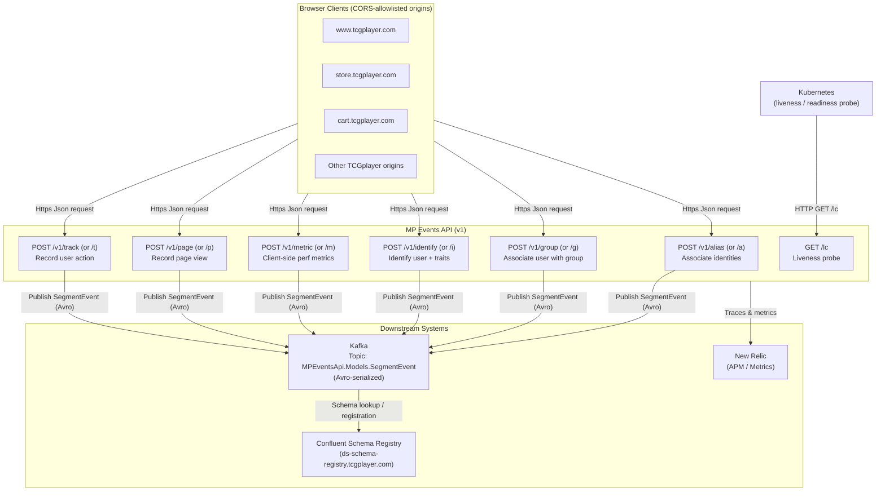
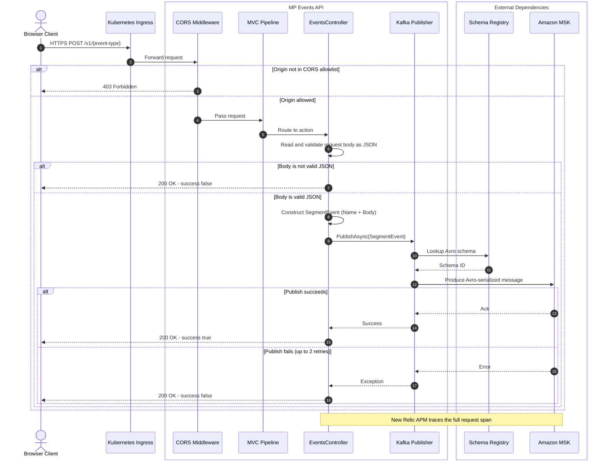

# mp-events-api service documentation

Document the service purpose, business value, ownership, architecture, dependencies, operational context, and delivery history in one place. This page is designed to work well for engineering, support, product, and platform teams that need a reliable reference.

**Service name:** mp-events-api | **Primary owner:** MP Discovery
**Repository:** [https://github.com/TCGplayer/mp-events-api](https://github.com/TCGplayer/mp-events-api) | **Jira board or project:** [Marketplace](https://tcgplayer.atlassian.net/jira/software/c/projects/BUY/boards/343)

## Purpose and value

The Marketplace Events API receives analytics events from TCGplayer web applications and forwards them to kafka for processing.

- **Problem it solves:** [Describe the need this service addresses]
- **Primary users or consumers:** [Internal teams, external users, systems, or applications]
- **Business impact:**

!!! info
    A good overview answers three questions quickly: **What is this service?** **Why does it matter?** **Who should care?**

## Current status

- **Lifecycle stage:** ACTIVE
- **Operational health:** HEALTHY
- **Support model:**
- **Criticality:** Tier 3

## Ownership and contacts

Capture the teams and channels responsible for building, operating, and approving changes to the service.

| Role | Owner | How to reach them |
|------|-------|-------------------|
| Engineering owner | MP Discovery | [#MPChat](https://tcgplayer.enterprise.slack.com/archives/C8FPEHELW) |
| Product owner | [Add team or person] | [Contact method] |
| Operations or support | [Add team or person] | [Contact method] |

## Key links

- **Source code:** [mp-events-api](https://github.com/TCGplayer/mp-events-api)
- **Runbook:**
- **Dashboard and monitoring:**
- **Alerts:**
- **API or technical spec:** [Add specification URL]
- **Jira epic or service label:** [Add Jira reference URL]

## Architecture and diagrams

### MP Events API — Flow Diagram


#### Example Payloads

All endpoints accept any valid JSON object in the request body. The following are representative Segment-format examples.

##### POST /v1/alias — Associate two identities

```json
{
  "userId": "user_123",
  "previousId": "anon_456",
  "timestamp": "2024-01-15T10:30:00Z"
}
```

##### POST /v1/group — Associate a user with a group

```json
{
  "userId": "user_123",
  "groupId": "store_789",
  "traits": {
    "name": "Acme Card Shop",
    "plan": "pro"
  },
  "timestamp": "2024-01-15T10:30:00Z"
}
```

##### POST /v1/identify — Identify a user and record traits

```json
{
  "userId": "user_123",
  "anonymousId": "anon_456",
  "traits": {
    "email": "user@example.com",
    "name": "Jane Doe"
  },
  "timestamp": "2024-01-15T10:30:00Z"
}
```

##### POST /v1/metric — Record a client-side performance metric

```json
{
  "type": "metric",
  "metric": "analytics.js",
  "value": 1,
  "tags": {
    "library": "analytics.js"
  },
  "timestamp": "2024-01-15T10:30:00Z"
}
```

##### POST /v1/page — Record a page view

```json
{
  "userId": "user_123",
  "name": "Home",
  "properties": {
    "url": "https://www.tcgplayer.com",
    "title": "TCGplayer - Buy, Sell and Collect",
    "referrer": "https://google.com"
  },
  "timestamp": "2024-01-15T10:30:00Z"
}
```

##### POST /v1/track — Record a user action

```json
{
  "userId": "user_123",
  "event": "Product Added",
  "properties": {
    "productId": "12345",
    "name": "Black Lotus",
    "price": 50000.00,
    "currency": "USD"
  },
  "timestamp": "2024-01-15T10:30:00Z"
}
```

### MP Events API — Sequence Diagram


## How the service works

The mp-events-api takes in event payloads then validates and queues them in kafka for processing.

1. **Entry points:** [API endpoints, events, jobs, UI actions, or scheduled triggers]
2. **Core logic:** validation
3. **Dependencies:** kafka
4. **Outputs:** kafka messages and http response of successful validation and queueing.

## Dependencies and integrations

| Dependency | Type | Why it is needed | Failure impact |
|------------|------|------------------|----------------|
| Kafka | queue | holding events while processing | failure to queue and http failures |

## Operational guidance

- **Deployment method:** [CI/CD pipeline, manual approval flow, release tooling]
- **Environments:** [Development, test, staging, production]
- **Monitoring signals:** [Latency, error rate, throughput, queue depth, saturation, business metrics]
- **Common failure modes:** [Dependency outage, timeout, bad config, schema mismatch, traffic spike]
- **Recovery approach:** [Rollback, replay, failover, cache clear, restart, feature flag]

## Risks and constraints

Record anything that affects the service design, delivery, compliance posture, or reliability expectations.

- [Known architectural constraint]
- [Security, privacy, or regulatory requirement]
- [Scalability or performance limitation]
- [Dependency or vendor risk]

## SAFE review history

| Change or release | What changed | Related Jira |
|-------------------|--------------|--------------|
| Service review | Yearly Service SAFE review | [Add Jira key] |
